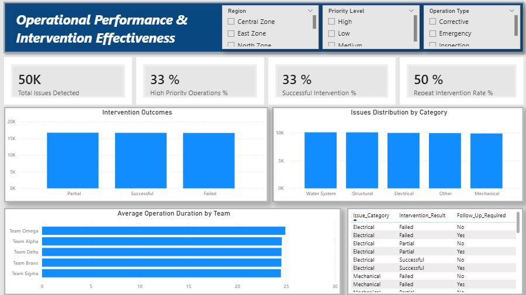
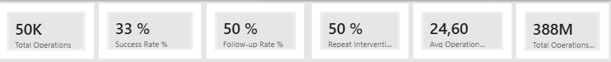

# 📊 Field Operations Performance Dashboard

## 📌 Project Overview

Field operations teams execute thousands of interventions across multiple regions.

However, decision-makers often lack visibility on:

- Operational effectiveness  
- Follow-up needs  
- Recurring failures  
- Resource efficiency  

This project transforms operational activity into **actionable insights** through strategic KPIs and an interactive dashboard.

---

## 🎯 Objective

Not just to visualize data —  
but to support decision-making by answering:

- Where are operations struggling?
- Are interventions actually solving problems?
- Which regions need attention?
- Where should resources be allocated?

---

## 📂 Dataset

A synthetic dataset of **50,000 field operations** was created to simulate real-world complexity.

Each record includes:
- Operation ID  
- Operation Date  
- Region  
- Site Type  
- Operation Type  
- Priority Level  
- Issue Category  
- Team Assigned  
- Intervention Result  
- Follow-Up Required  
- Repeat Intervention  
- Operation Cost  
- Operation Duration  

---

## 📈 Key KPIs

| KPI | Description |
|-----|-------------|
| Total Operations | Total interventions executed |
| Follow-up Rate | % of operations requiring follow-up |
| Success Rate | % of successful interventions |
| Repeat Intervention Rate | % of recurring issues |
| Failure Risk % | Operational instability indicator |
| Avg Operation Duration | Efficiency measure |
| Avg Operation Cost | Resource consumption indicator |

---

# 📊 Dashboard Preview

## 🟦 Page 1 — Operations Overview

---

## 🟩 Page 2 — Intervention Effectiveness

---

## 🟨 Page 3 — Follow-up & Risk Monitoring

---

## 🟥 Page 4 — Executive Summary

---

## 🔍 KPI Focus

---

## 💡 Key Insight

A notable share of operations require follow-up, indicating:

👉 Some interventions fix symptoms — not root causes.

This suggests the need for:

- Preventive actions  
- Better issue classification  
- Resource prioritization  

---

## 🛠 Tools Used

- Excel (Data Generation)  
- Power BI (Data Modeling & Visualization)

---

## 📁 Project Structure

---

## 📌 Outcome

This dashboard enables:

✔️ Performance visibility  
✔️ Risk awareness  
✔️ Strategic decision-making  

Moving beyond reporting into proactive management.

---

## 👩‍💻 Author

Fatima Jouiry  
Data Analyst

